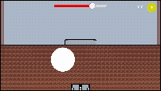

# CustomerInteractionAndAI

## Description 
this is a demonstration for my customer interaction system for my upcoming game "Chrono-Vice". This system is built upon 2 AI behaviors, buying and selling. Buying is based off of randomized customer interests, to where customers have specific interests of what store items they want. Selling uses a reputation meter to determine offers customers will provide to the player so they can buy. 
### NPC Behaviors
The [customer](Assets/scripts/customerAI/customer.cs) NPC only has 2 behaviors, buying and selling. Buying is based off of a want [group](Assets/scripts/customerAI/customerWantsGroup.cs). Upon calling buy() the NPC iterates through the group and determines what item/brand they want, in this simple project the only possible brands are the placeholders of Squares,Circles,and Triangles all with their own brand date [group](Assets/scripts/ItemBrandData.cs). Then using collider [triggers](Assets/scripts/customerAI/customerTriggers.cs), the NPC either rejects or accepts and pays based on the brand item given. The Second Behavior, selling, spawns in a random item and determines the price of the item based on player [reputation](Assets/scripts/reputationMeter/reputationMeter.cs) and item brand price. In this case, if a players reputation is 100%, then customers will sell items at 30% value. On the other hand, if player reputation is 1%, then items will be sold at 130% value. Reputation in a sense also acts like a health bar, so if a players reputation is 0% the game ends. Same case with [currency](Assets/scripts/currency.cs).
## Demonstration

### Note:
I didn't make animations for this micro-project, but they are planned for "Chrono-Vice".

